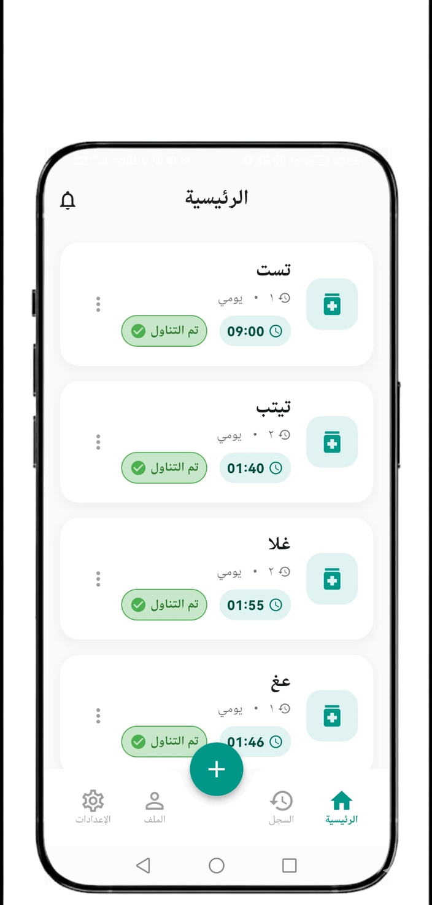
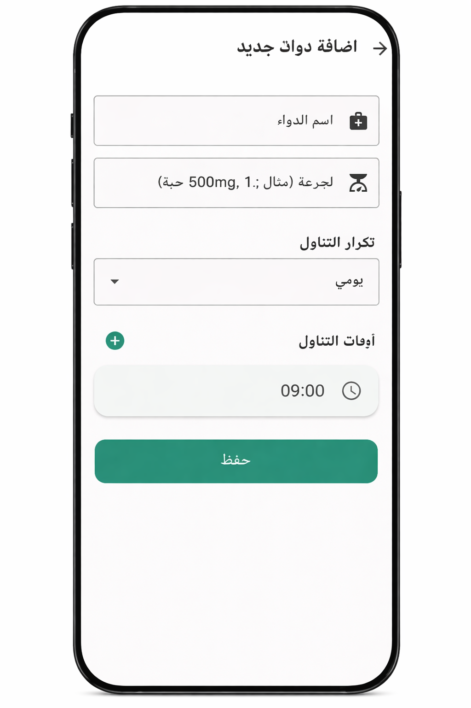
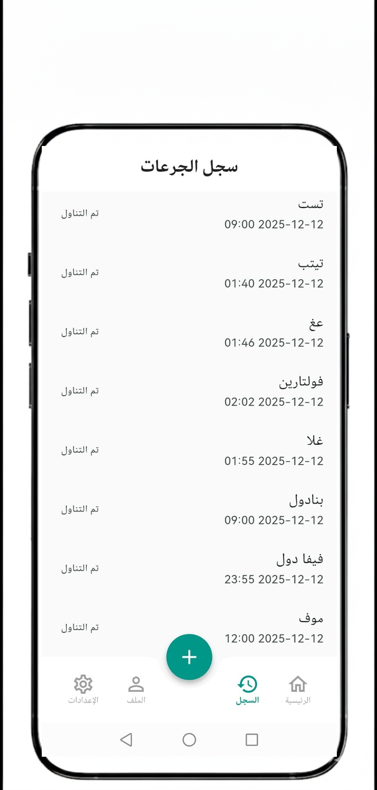
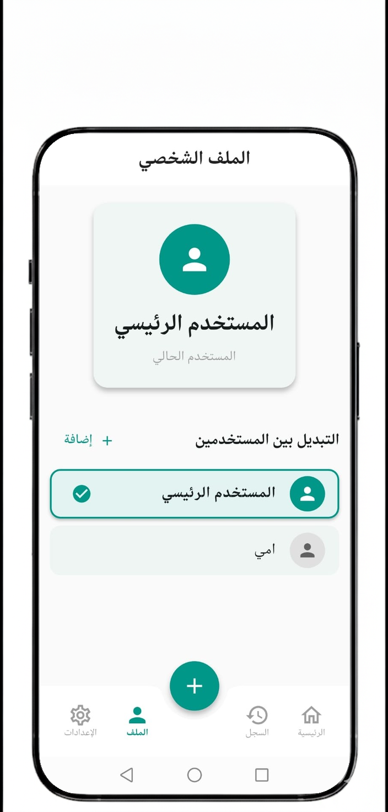
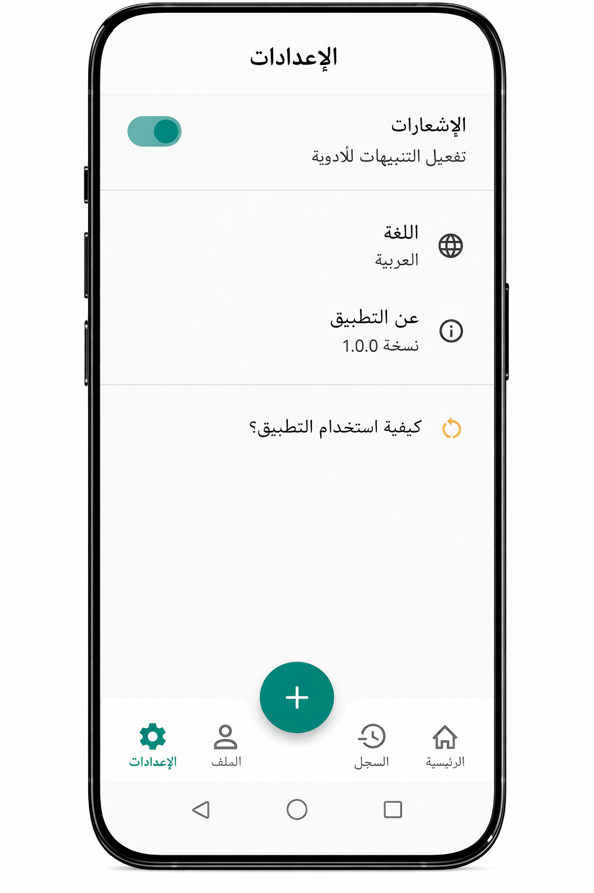
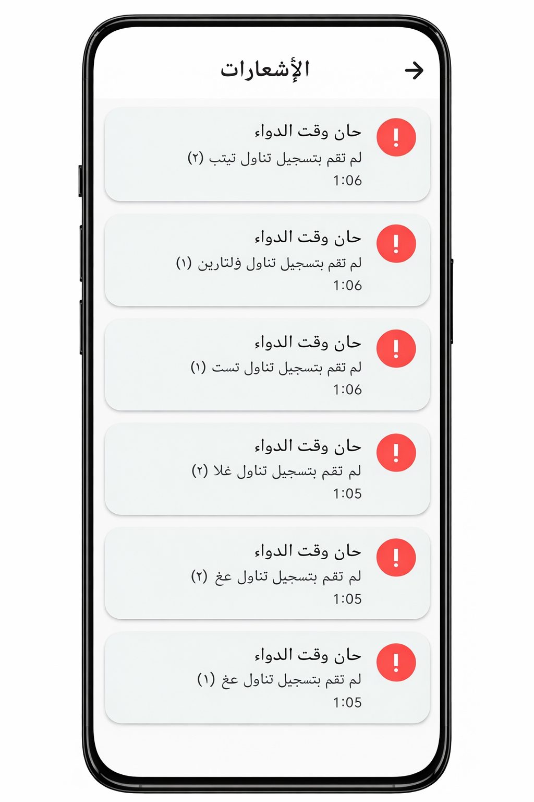

# DAWAK (دواؤك)
### Track, Schedule, adherence - Your Personal Medication Companion

<p align="center">
  
  
  
</p>

<p align="center">
  Built with the tools and technologies:
</p>

<p align="center">
  
  
  
</p>

<br>

## Table of Contents
- [Overview](#overview)
- [Why Dawak?](#why-dawak)
- [Architecture](#architecture)
- [Getting Started](#getting-started)
  - [Prerequisites](#prerequisites)
  - [Installation](#installation)
- [Usage](#usage)
  - [Adding Medications](#adding-medications)
  - [Managing Profiles](#managing-profiles)
  - [Tracking History](#tracking-history)
- [Project Structure](#project-structure)
- [Screenshots](#screenshots)
- [Contributing](#contributing)
- [License](#license)

<br>

## Overview
**Dawak** (Arabic for "Your Medicine") is a comprehensive Flutter application designed to help you manage your medication schedule with ease. Support for multiple family profiles, personalized reminders, and adherence tracking ensures you and your loved ones never miss a dose.

<br>

## Why Dawak?
Managing multiple prescriptions for different family members can be overwhelming. Dawak provides:

- **Peace of Mind**: Reliable local notifications ensure you take the right dose at the right time.
- **Family Focused**: Manage profiles for yourself, parents, or children all in one place.
- **Privacy First**: All data is stored locally on your device using Shared Preferences; no internet required.
- **Track Record**: Keep a history of taken, skipped, and missed doses to share with healthcare providers.
- **User Friendly**: Clean, intuitive interface with Arabic language support (`دواؤك`).

<br>

## Key Features
- 👥 **Multi-Profile Support**: Switch between user profiles to manage medications for the whole family.
- 💊 **Flexible Scheduling**: Set daily, weekly, or custom intervals for any medication.
- 🔔 **Smart Reminders**: Receive timely notifications even when the app is closed.
- 📊 **Adherence History**: Visual logs of your medication habits.
- 🌙 **Modern UI**: Built with Material 3 design principles.

<br>

## Architecture
The app follows a clean architecture pattern with separation of concerns:

```
lib/
├── main.dart
├── models/
│   ├── dose_log.dart
│   ├── medication.dart
│   └── user_profile.dart
├── providers/
│   ├── medication_provider.dart
│   └── profile_provider.dart
├── screens/
│   ├── add_medication_screen.dart
│   ├── dashboard_screen.dart
│   ├── history_screen.dart
│   ├── main_screen.dart
│   ├── notification_screen.dart
│   ├── onboarding_screen.dart
│   ├── profile_tab.dart
│   └── settings_tab.dart
└── services/
    ├── notification_service.dart
    └── storage_service.dart
```

### Tech Stack
- **Framework**: Flutter 3.0+
- **Language**: Dart
- **State Management**: Provider
- **Local Storage**: Shared Preferences
- **Notifications**: flutter_local_notifications
- **Utilities**: intl, uuid, timezone

<br>

## Getting Started

### Prerequisites
Before you begin, ensure you have:
- Flutter SDK (version 3.0.0 or higher)
- Dart SDK
- Android Studio / VS Code with Flutter extensions
- An Android or iOS device/emulator

### Installation

1. **Clone the repository**
   ```bash
   git clone https://github.com/OsmanMj/Dawak-.git
   cd dawak
   ```

2. **Install dependencies**
   ```bash
   flutter pub get
   ```

3. **Run the app**
   ```bash
   flutter run
   ```

<br>

## Usage

### Adding Medications
Tap the "+" button on the home screen.
- **Name**: Enter medication name.
- **Dosage**: Specify amount (e.g., 1 pill, 5ml).
- **Schedule**: Choose frequency and time.

### Managing Profiles
Go to the Profile tab to:
- **Create**: Add a new profile for a family member.
- **Switch**: Tap a profile to view their specific schedule.
- **Edit**: Update details or delete profiles.

### Tracking History
- **View**: Check the History tab to see past logs.
- **Status**: See at a glance which doses were taken or missed.

<br>

## Project Structure
### Key Components

#### Providers
- **MedicationProvider**: Manages list of medications and logic.
- **ProfileProvider**: Handles user profiles and state switching.

#### Services
- **StorageService**: Persists data to local device storage.
- **NotificationService**: Schedules and cancels local system notifications.

<br>

## Screenshots

 Dashboard | Add Medication | History | Profile | Settings | Notification |
| :---: | :---: | :---: | :---: | :---: | :---: |
|  |  |  |  |  |  |


<br>

## Contributing
Contributions are welcome! Here's how you can help:

1. Fork the repository
2. Create a feature branch (`git checkout -b feature/AmazingFeature`)
3. Commit your changes (`git commit -m 'Add some AmazingFeature'`)
4. Push to the branch (`git push origin feature/AmazingFeature`)
5. Open a Pull Request

<br>

## License
This project is licensed under the MIT License - see the LICENSE file for details.

---
<p align="center">Made with ❤️ using Flutter</p>
